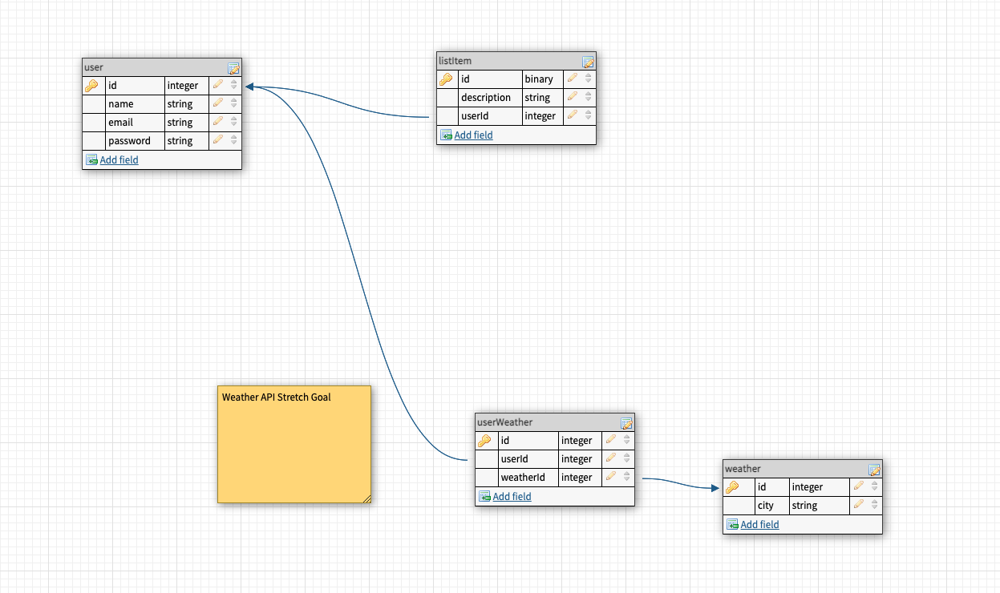
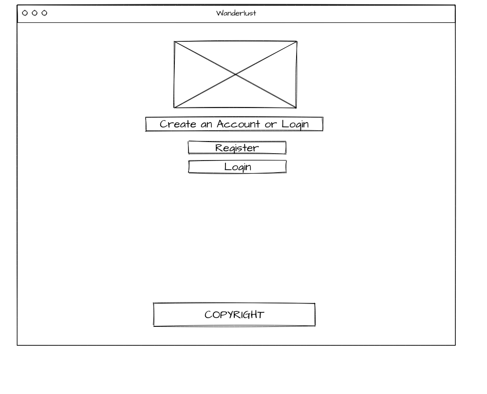
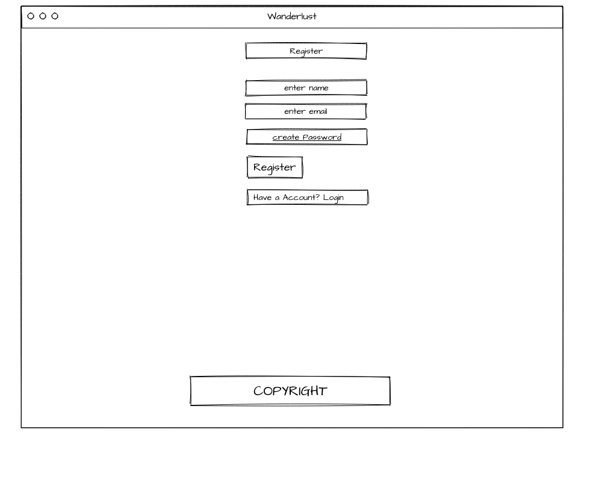
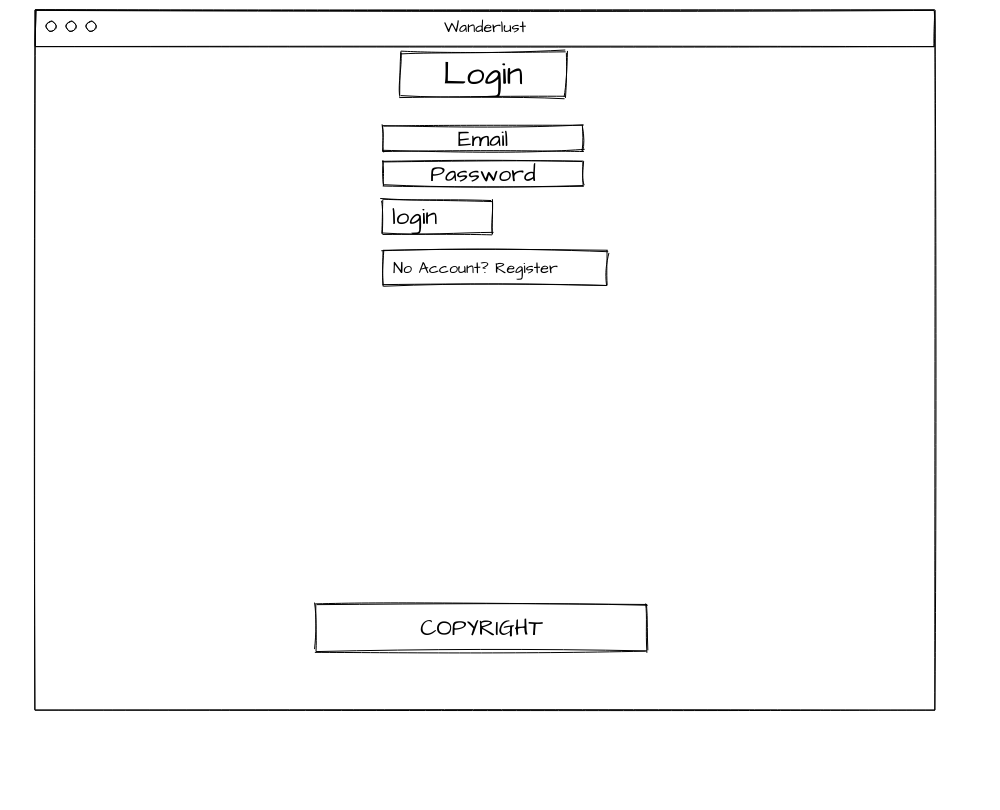
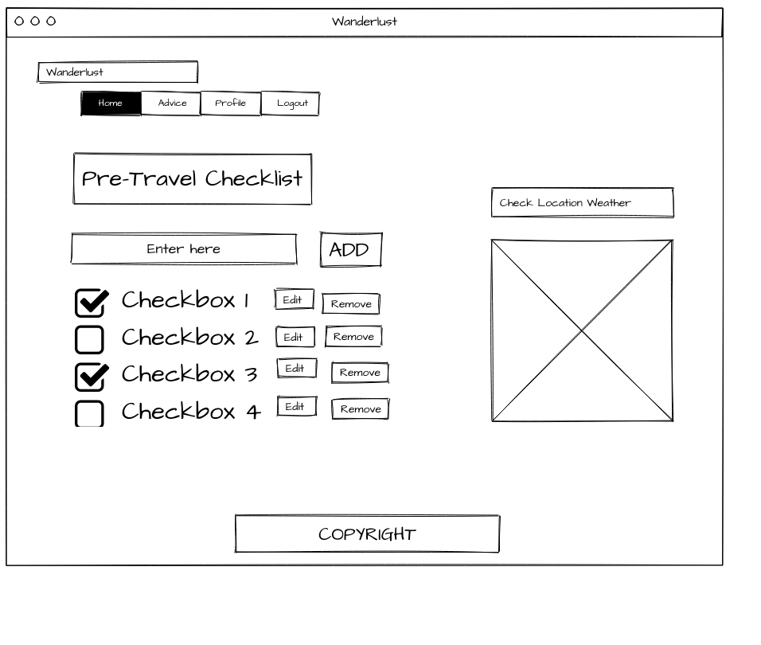
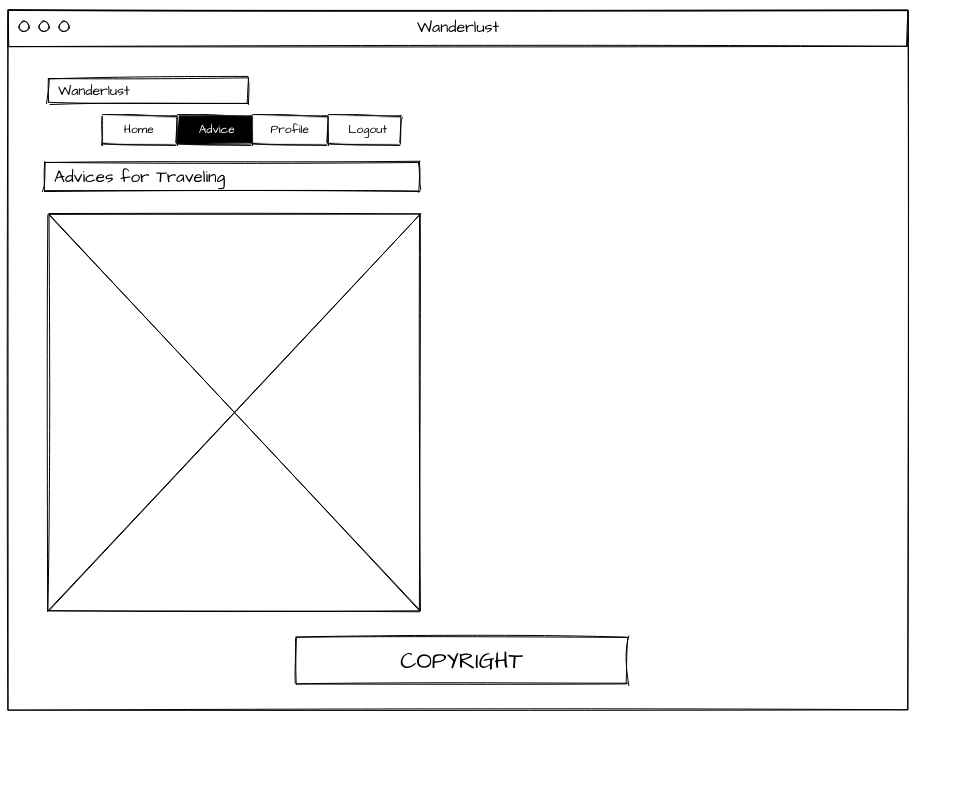
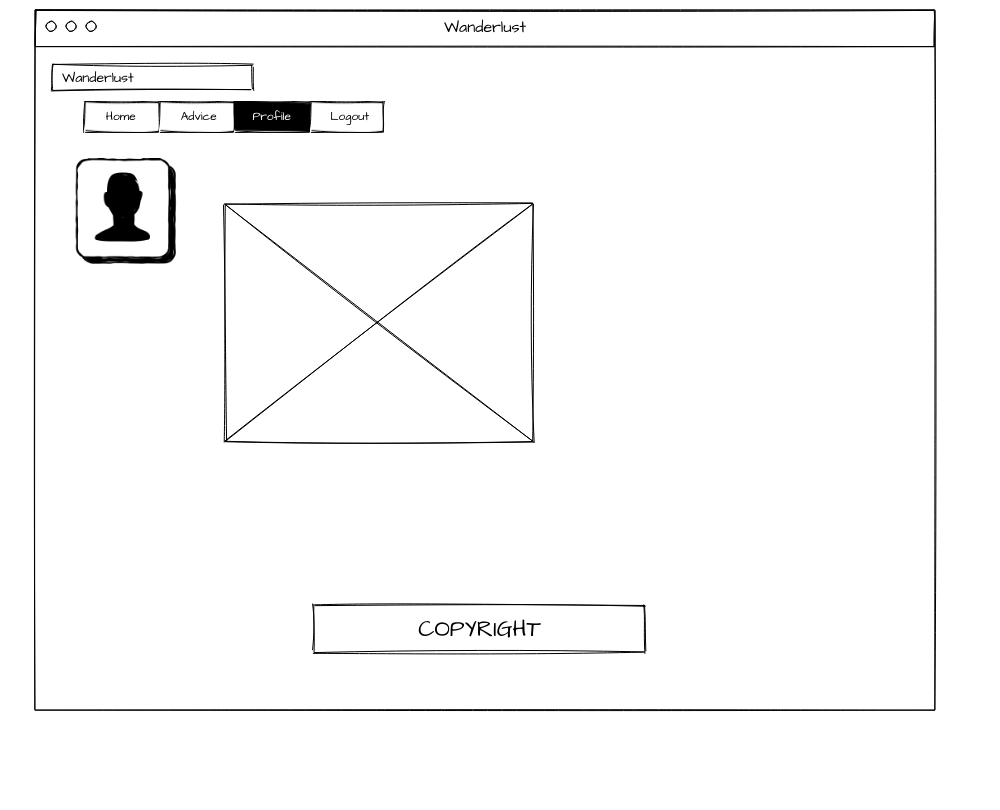

# Wanderlust-

#### Overview 
This project is a planner. FIrst, a user would need to sign up and make an account. Once the account is made, you will be able to add, update, and remove items from your to do list. 

### Wireframe 

### User Stories

-When I sign up with a name, email and password, an account should be made. 

-When I try to log in with my email and password, I should be sent to my profile page 

-When I try to post a new item, it should appear in my to do list 

-When I click on the edit buttons next to the items, I should be able to edit them 

When I click on the minus button next to the items, the items should be deleted

### Routes
| Functions              | Detail                                            | URL                         | HTTP Verb |
| :--------------------: | ------------------------------------------------- | --------------------------- |-----------|
| Sign up for an account | 1. User is able to register with Name, Email and Password | /register | app.post |
| Log in with email | 1. User can log in using registered email 2. User can get a warning message for incorrect password or unregistered account | /login | app.post |
| Log out | 1. User can log out of an account 2. User can get a reminder for successful logout | /users/logout | app.get |
| Create a checklist | 1. User can add a checklist with detail after login 2. User can get a warning message for invalid input format | /users/checklist/new | app.post |
| Edit a checklist | User can update detail info of a checklist after login | /users/checklist/edit/:id | app.put |
| Delete a checklist | 1. User can delete a checklist after login 2. User can receive a warning message before actual delete | /users/checklist/delete/:id | app.delete |
| Profile | User can checkout their personal profile such as name and email | /users/profile | app.get |
| Shows register page | Presentational of registerging for account | /userRegisterPage | app.get| 
| Shows login page | Presentational of logging in | /userLoginPage | app.get |
| Shows edit button | User can see edit button | /:userId/item/:itemId | app.get |
| View home | Views user home based on ID | /:id/home | app.get | 

___
### MVP 

-(Am I able to create a profile) 

-(Am I able to login once I have already made a profile)

-(Am I able to add on to my to do list) 

-(Am I able to edit my to do list)

-(Am I able to delete items from my to do list)

-(Am I able to log out successfully?) 
### Stretch Goals 
-Advice page

-Add weather API 

