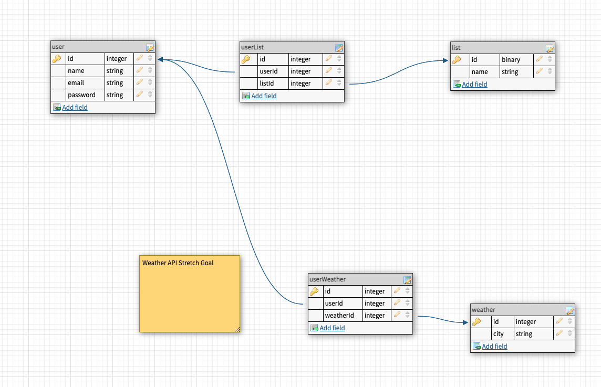
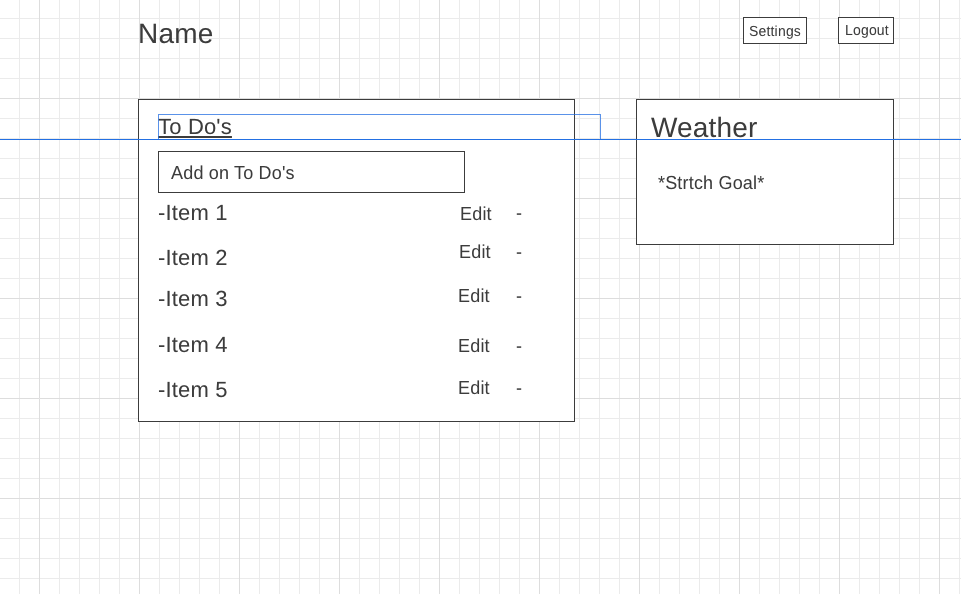

# Wanderlust-

####Overview 
This project is a planner. FIrst, a user would need to sign up and make an account. Once the account is made, you will be able to add, update, and remove items from your to do list. 

### Wireframe 

###User Stories
-When I sign up with a name, email and password, an account should be made. 
-When I try to log in with my email and password, I should be sent to my profile page 
-When i try to post a new item, it should appear in my to do list 
-When I click on the edit buttons next to the items, i should be able to edit them 
When I click on the minus button next to the items, the items should be deleted
-When I click the log out button, i should not see my page anymore but instead the home screen 

###Routes
-route to register an account  
-route to log into your account
-route to posts to to-do list 
-route to edit posts
-route to delete posts
-route to log out 

###MVP 
-Am I able to create a profile 
-Am I able to login once I have already made a profile
-Am I able to add on to my to do list 
-Am I able to edit my to do list
-Am I able to delete items from my to do list
-Am I able to log out successfully? 

###Stretch Goals 
-Add weather API 